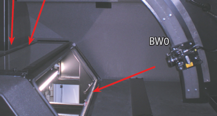
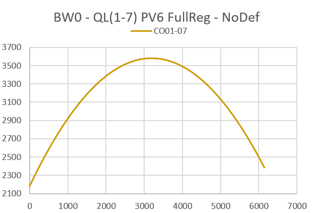
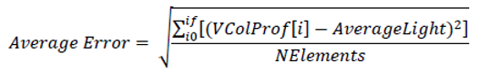
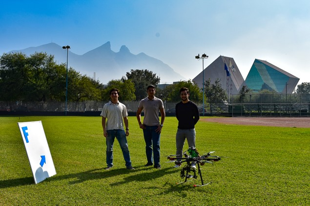
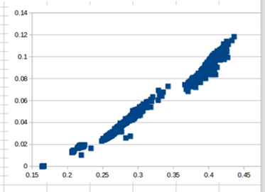
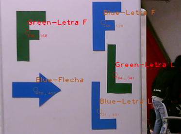
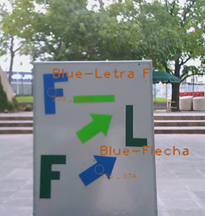
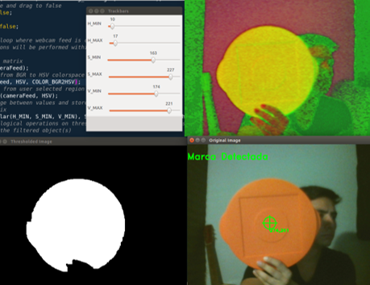
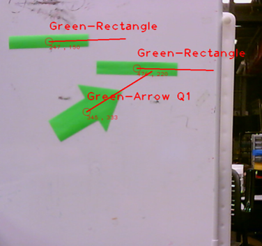

## Curriculum Vitæ

### Personal Information

Birthdate: | March / 19 / 1994
Birthplace: | Monterrey, Mexico
Civil Status: | Single
Address: | Arnoldstraβe 18, 22765, Hamburg, Germany
Cellphone: | +52 152 2133 4325
German Visa: | Type d (Arbeitsplatzsuche)
Prof. interests: | Innovation, Image processing, Automation

[Go to LinkedIn Profile](https://www.linkedin.com/in/carlosefabila/)

[Go to Xing Profile](https://www.xing.com/profile/CarlosEduardo_FabilaGarcinava)

### Education

08.12 – 12.17 | B.S. in Mechatronics Engineering (Average: 90/100)
 |  CENEVAL Award to the Performance Excellence – EGEL
 |  Tecnológico de Monterrey, Campus Monterrey, Mexico

08.15 – 12.17 | Research and Innovation Certificate
 |  Tecnológico de Monterrey, Campus Monterrey, Mexico

### Software

LabVIEW: | Certified LabVIEW Associate Developer
SolidWorks: | Certified SolidWorks Associate
C++: | Experienced
Python: | Familiar
Unigraphics Nx8: | Familiar
TwinCAT 3: | Familiar
Matlab, Scilab: | Basic Knowledge
Microsoft SQL Server: | Basic Knowledge

### Languages

Spanish: | Native speaker
English: | Advanced fluency; Level: C1
Italian: | Advanced fluency; Level: C1
Brazilian Portuguese: | Intermediate fluency
German: | Intermediate fluency (Currently studying B1)

## Project 1 - Illumination Corrector Algorithm
### (*Italy*)

### Objectives

1: | Find the equation from a curve that represents the image distortion in a vision-based quality control system.
2: | Test the new calibration method by comparing it with the previous manual method.

### Software

Language: | C++
Library: | MIL (Matrox Imaging Library)
IDE: | Visual Studio
OS: | Windows

### Methodology

1: | Simulated the previous calibration method using a “Calibration Tile”
2: | Obtained the image distortion equation by applying a quadratic regression to the average profile from several sample tiles.
3: | Simulated the new calibration method using the image distortion equation.
4: | Calculated the error from both methods applied to several sample tiles and compared them.
5: | Deliver an algorithm that applies an illumination correction to the images taken by Qualitron system.

### Sample Images - Sample Profile - Curve and Adjusted Profile

## Project 2 - Hexacopter's Flight Control System
### Tecnológico de Monterrey (*Mexico*)

### Objectives

1: | Developed a program that recognized pre-defined marks as flight commands under variable light conditions.
2: | Ran the program in a single-board Linux operated computer on an Hexacopter.
3: | Communicated the commands to the drone’s flight controller.

### Software

Language: | C++
Library: | OpenCV
Text editor: | Sublime Text
OS: | Ubuntu

### Methodology

1: | Selected the color space (HSV) to apply a color filter.
2: | Compared multiple shape recognition methods and selected the one with the best performance (Hu moments).
3: | Developed a marks recognition algorithm.
4: | Tested algorithm under different light conditions.
5: | Tested program controlling the flight of an AR Parrot.
6: | Deliver a final presentation and report of the achievements and conclusions.

### Testing of different features for the program

